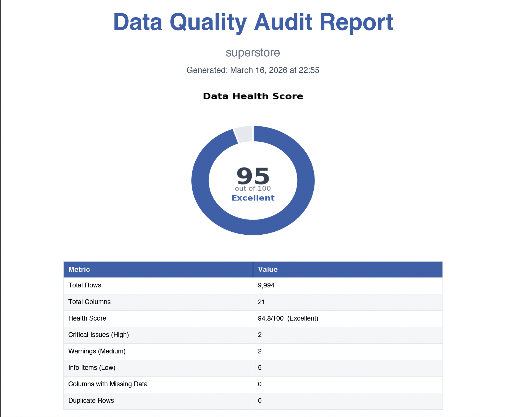
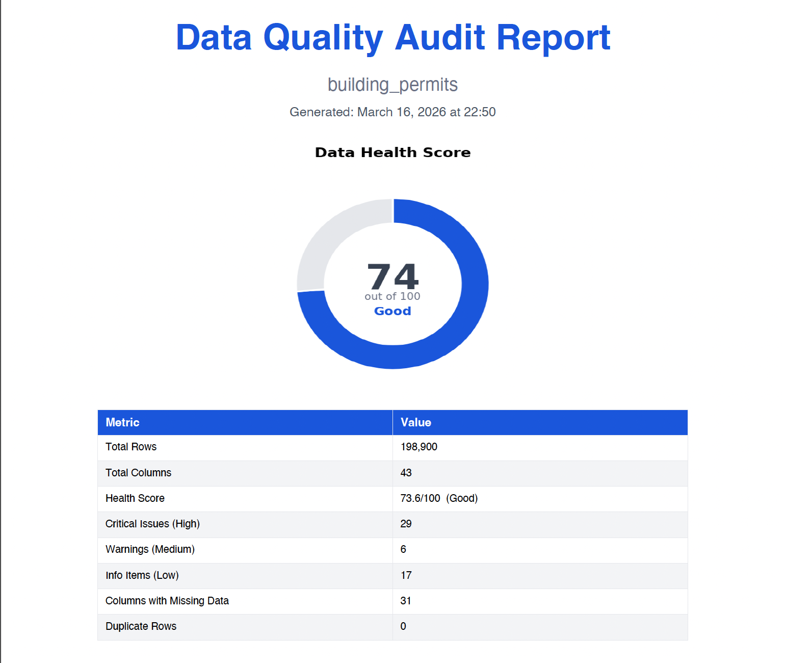

# Data Quality & Reporting Pipeline

Automated data quality auditing and professional report generation powered by custom Claude Skills. Point it at any CSV or Excel dataset and it produces a multi-page PDF report with charts and a detailed Excel workbook — no manual analysis required.

---

## Screenshots

### High-quality dataset — Superstore (94.8 / 100 · Excellent)


[View full PDF](examples/sample-outputs/high.pdf) · [View Excel workbook](examples/sample-outputs/high.xlsx)

### Problematic dataset — Building Permits (73.6 / 100 · Good)


[View full PDF](examples/sample-outputs/low.pdf) · [View Excel workbook](examples/sample-outputs/low.xlsx)

> **👉 [View the full sample reports →](examples/sample-outputs/)**

---

## What It Does

The pipeline runs two complementary skills:

| Skill | Trigger | Output |
|---|---|---|
| **Data Auditor** | "audit this data", "what's wrong with this file?", "data health check" | PDF audit report + Excel findings workbook |
| **Report Generator** | "summarize this data", "create a report", "analyze this file" | PDF summary report + Excel profile workbook |

Both skills are fully automated. Load a skill into Claude, upload a CSV or Excel file, and Claude does the rest.

---

## Project Structure

```
data-quality-pipeline/
├── skills/
│   ├── data-auditor/
│   │   └── SKILL.md                  # Full audit skill definition
│   └── report-generator/
│       ├── SKILL.md                  # Full report generation skill definition
│       └── references/
│           └── report-template.md    # PDF layout and style reference
├── examples/
│   ├── raw-data/                     # Input datasets (gitignored — download via Kaggle CLI)
│   ├── audit-reports/                # Generated audit PDFs and Excel files (gitignored)
│   └── final-reports/                # Generated summary reports (gitignored)
├── scripts/
│   └── run_audit.py                  # Standalone Python script — runs the full audit pipeline
└── docs/
    └── case-study.md                 # Real-world example walkthrough
```

---

## Skill 1 — Data Auditor

### What It Checks

Runs **8 quality checks** on every applicable column:

| # | Check | Severity Logic |
|---|---|---|
| 1 | **Missing Values** | High > 20%, Medium 5–20%, Low < 5% |
| 2 | **Duplicate Rows** | High > 5%, Medium 1–5%, Low < 1% |
| 3 | **Data Type Validation** | Detects numbers stored as strings, mixed types |
| 4 | **Outlier Detection** | IQR method — High > 10%, Medium 3–10%, Low < 3% |
| 5 | **Date Format Consistency** | Flags mixed formats (MM/DD/YYYY vs YYYY-MM-DD etc.) |
| 6 | **Text Casing Inconsistencies** | Flags columns with no dominant casing pattern |
| 7 | **Whitespace Issues** | Leading/trailing spaces, double spaces |
| 8 | **Column Name Quality** | Unnamed columns, spaces, special characters |

### Health Score

Computes an overall score out of 100 using a weighted formula:

| Category | Weight | How It's Scored |
|---|---|---|
| Completeness | 35% | `100 − avg_missing_pct − (4 pts × columns_over_50%_missing, max −40)` |
| Type Consistency | 20% | `100 − avg_type_mismatch_pct` |
| Uniqueness | 15% | `100 − duplicate_row_pct` |
| Outlier Reasonability | 12% | `100 − avg_outlier_pct` |
| Format Consistency | 10% | Penalises mixed date formats |
| Text Quality | 8% | `100 − avg_casing_and_whitespace_issue_pct` |

**Ratings:** Excellent (90–100) · Good (70–89) · Fair (50–69) · Poor (< 50)

> The Completeness weight was raised to 35% and an additional per-column penalty was added for columns with >50% missing values — so a dataset with many near-empty columns scores significantly lower than one with uniform, mild missingness.

### PDF Report Pages

| Page | Content |
|---|---|
| 1 | Cover — dataset name, date, health score gauge chart, summary stats |
| 2 | Executive Summary — written overview, score breakdown table, pie chart |
| 3 | Findings Summary — 10–15 sentences covering every quality dimension |
| 4 | Missing Values Analysis — bar chart + severity-coded table |
| 5 | Issue Severity Heatmap — checks vs columns grid, colour-coded H/M/L |
| 6 | Distribution Analysis — histograms for numeric columns with IQR bounds |
| 7 | Trend Analysis — rolling-average line charts (only if date column exists) |
| 8 | Detailed Findings — full table of all issues sorted by severity |
| 9 | Recommendations — prioritised actions with estimated score impact (landscape) |

### Excel Workbook Sheets

| Sheet | Content |
|---|---|
| Summary | Dataset overview and health score |
| Details | All issues with severity colour-coding and filters |
| Recommendations | Prioritised remediation steps |
| Severity Heatmap | Native Excel grid matching the PDF heatmap, colour-coded with borders |

---

## Skill 2 — Report Generator

### What It Produces

Designed for **clean or pre-audited data** — generates a polished summary report rather than a quality assessment.

### Charts Generated

| Figure | Description |
|---|---|
| 1 | Dataset overview horizontal bar chart |
| 2 | Column type distribution pie chart |
| 3 | Distribution histograms for numeric columns |
| 4 | Top-values bar charts for categorical columns |
| 5 | Correlation heatmap (requires 3+ numeric columns) |
| 6 | Trend lines with rolling averages (requires date column) |

### PDF Report Pages

| Page | Content |
|---|---|
| 1 | Cover — dataset name, date, overview chart, key stats |
| 2 | Executive Summary — plain-language findings, composition pie chart |
| 3 | Distribution Analysis — histograms with skew annotations |
| 4 | Categorical Analysis — top-values bar charts |
| 5 | Correlation Analysis — heatmap + written interpretation (if applicable) |
| 6 | Trend Analysis — time series charts (if applicable) |
| 7 | Column Profiles — full per-column stats table |
| 8 | Notable Findings & Methodology |

### Excel Workbook Sheets

| Sheet | Content |
|---|---|
| Overview | Key metrics in a clean layout |
| Column Profiles | Full stats per column (mean, median, std, min, max, nulls, unique values) |
| Correlations | Full correlation matrix with conditional formatting |
| Top Categories | Top 10 values per categorical column |

---

## Standalone Script — `scripts/run_audit.py`

The audit logic is also available as a self-contained Python script that runs locally without Claude.

### Installation

```bash
pip install pandas numpy matplotlib seaborn reportlab openpyxl
```

### Usage

1. Set the input file path at the top of the script:

```python
INPUT_FILE = os.path.join(BASE_DIR, "examples", "raw-data", "your_file.csv")
```

2. Run:

```bash
python scripts/run_audit.py
```

3. Outputs are saved to `examples/audit-reports/`:
   - `audit_report_<dataset>_<date>.pdf`
   - `audit_data_<dataset>_<date>.xlsx`

### Supported Datasets

The script auto-detects encoding (UTF-8, latin-1, cp1252) and handles:
- Datasets up to 200k+ rows
- Up to 43+ columns (heatmap capped at 20 most problematic columns)
- Mixed date formats (MM/DD/YYYY, YYYY-MM-DD, DD-MM-YYYY)
- Currency-formatted numeric strings (`$1,200`)
- Columns with spaces or special characters in names

### Tested Datasets

| Dataset | Rows | Columns | Health Score |
|---|---|---|---|
| [Sample Sales](examples/raw-data/sample_sales.csv) | 201 | 10 | 74.0 — Good |
| [Café Sales (Kaggle)](https://www.kaggle.com/datasets/ahmedmohamed2003/cafe-sales-dirty-data-for-cleaning-training) | 10,000 | 8 | 90.0 — Excellent |
| [Superstore (Kaggle)](https://www.kaggle.com/datasets/vivek468/superstore-dataset-final) | 9,994 | 21 | 94.8 — Excellent |
| [Building Permits (Kaggle)](https://www.kaggle.com/datasets/aparnashastry/building-permit-applications-data) | 198,900 | 43 | 73.6 — Good |

---

## Using the Skills with Claude

1. Open [Claude.ai](https://claude.ai) and start a new conversation
2. Load the skill by pasting the contents of `skills/data-auditor/SKILL.md` (or `skills/report-generator/SKILL.md`) into the system prompt or a Projects instruction
3. Upload your CSV or Excel file
4. Say something like:
   - *"Audit this data"*
   - *"Run a data quality check on this file"*
   - *"What's wrong with this dataset?"*
   - *"Generate a report from this data"*

Claude will run the full pipeline and deliver the PDF and Excel files.

---

## Output Naming Convention

```
audit_report_<dataset_name>_<YYYY-MM-DD>.pdf
audit_data_<dataset_name>_<YYYY-MM-DD>.xlsx
report_<dataset_name>_<YYYY-MM-DD>.pdf
report_data_<dataset_name>_<YYYY-MM-DD>.xlsx
```

---

## Dependencies

```
pandas
numpy
matplotlib
seaborn
reportlab
openpyxl
```

Install all at once:

```bash
pip install pandas numpy matplotlib seaborn reportlab openpyxl
```

---

## License

MIT © 2026
